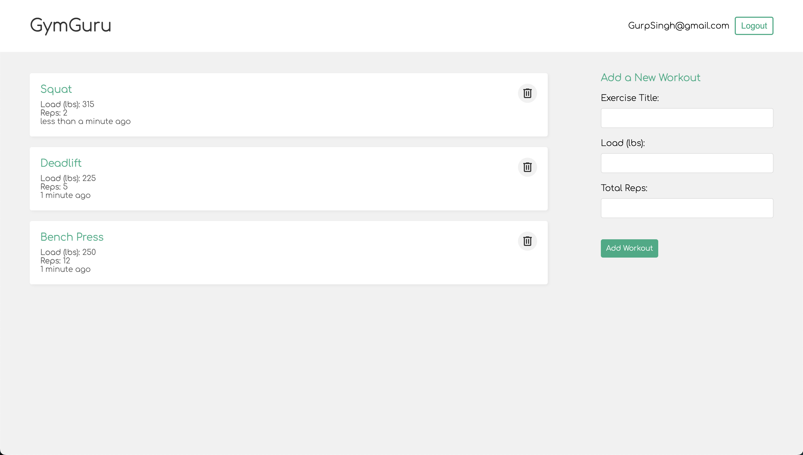

# GymGuru (Workout Tracker)

### [Deployment Link 🚀](https://gymtime-workout-tracker.vercel.app)

This workout tracker is perfect for the avid gym goer who wants to keep track of their workouts and observe their progression day by day.

# Preview

# Features
1. User-friendly interface that allows easy navigation 
2. Allows inputting of Workout information (Sets, reps, weight)
3. Login, Logout, Sign Up functionality

# Upcoming Features 
These are some features that I would like to implement in the future:
- [ ] Add dropdown menu that shows previous workouts in add workout section
- [ ] Add in chart/analytics for each workout for users to see progression
- [ ] Allow users to add in profile picture
- [ ] Create a calendar for users to see what workout was done what day

# Built With
- MongoDB
- Express
- Node
- React

# Getting Started

Assuming you have npm installed, you will need to:

1. Clone this project:  
   `git clone https://github.com/GSinghh/MERN-Workout-Tracker.git`

2. Change into repository directory: 
   `cd MERN-Workout-Tracker` 

3. Once you have cloned this project, you can install the required dependencies by using:  
   `npm install`

4. Create a .env file and give each of these variables below a value: 
   `MONGO_URI`:  MongoDB Database URL  
   `PORT`:  Port number to start the server on  
   `SECRET`: Used to sign JSON Web Token
   

---

Developed by Gurpreet Singh Bassan

